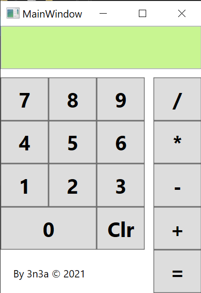

# gibz-m404

## Taschenrechner WPF

* [Tutorial PDF](TaschenrechnerWPF/Aufgabe%20Einfacher%20Taschenrechner.pdf)
* [Sourcecode](TaschenrechnerWPF/)
* [ZIP Installationspaket](https://github.com/3n3a/gibz-m404/releases/download/wpf-v1/TaschenrecnerWPF-v1.zip)
